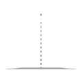
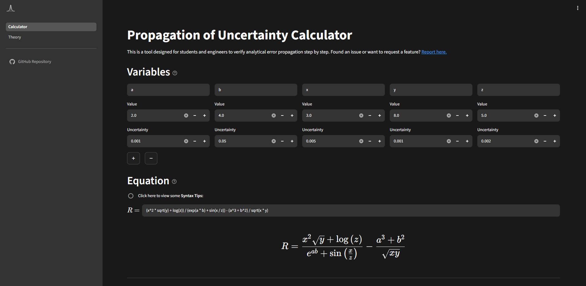

<div align="center">
  
  <h1>Propagation of Uncertainty Calculator</h1>
  <p>Analytical error propagation and metrology tool for engineering students.</p>
</div>
  
---

## Access

You can access the application online at [Propagation of Uncertainty Calculator](https://propagation-of-uncertainty-calculator.streamlit.app) or run it locally by cloning this repository.

## Overview

A Streamlit-based web application designed to assist engineering and physics students with experimental measurement analysis and metrology. This tool computes **partial derivatives**, performs **propagation of uncertainty**, and generates **exportable outputs** in LaTeX and Excel formats, optimizing the workflow and lab reports.



## Key Features

* **Uncertainty Propagation:** Computes and displays the combined uncertainty and the analytical partial derivatives.
* **Uncertainty Budget:** Tabulates relative uncertainties, sensitivity coefficients, and contribution percentages.
* **Rounding:** Automatically aligns reported values and uncertainties to proper significant figure conventions.
* **Export Utilities:** Clickable expressions for direct copy-to-clipboard support of LaTeX code and Excel formulas.
* **Theoretical Section:** Provides the theoretical foundations and mathematical principles behind the propagation of uncertainty, including formulas and a practical example.

## Law of Propagation of Uncertainty

For an arbitrary model $Y = f(X_1, X_2, \dots, X_N)$ with **independent variables**, the combined standard uncertainty $u_c(y)$ is evaluated via first-order Taylor series approximation:

$$\large
u_c(y) = \sqrt{\sum_{i=1}^{N} \left( \frac{\partial f}{\partial x_i} \right)^2 u^2(x_i)}
$$

Or in terms of sensitivity coefficients $c_i$:

$$\large
u_c(y) = \sqrt{\sum_{i=1}^{N} c_i^2 \, u^2(x_i)} \hspace{1mm}, \quad c_i = \frac{\partial f}{\partial x_i}
$$

> **Note:** This only applies for independent variables, since the covariance terms vanish.

## References

* **[JCGM 100:2008 (GUM)](https://www.bipm.org/documents/20126/2071204/JCGM_100_2008_E.pdf)** — *Evaluation of measurement data — Guide to the expression of uncertainty in measurement*.
* **[JCGM GUM-6:2020 (GUM)](https://www.bipm.org/documents/20126/2071204/JCGM_GUM_6_2020.pdf/d4e77d99-3870-0908-ff37-c1b6a230a337)** — *Guide to the expression of uncertainty in measurement — Part 6: Developing and using measurement models*.
* **[JCGM 200:2012 (VIM)](https://www.bipm.org/documents/20126/41373499/JCGM_200_2012.pdf/f0e1ad45-d337-bbeb-53a6-15fe649d0ff1)** — *International Vocabulary of Metrology – Basic and general concepts and associated terms*
* **[IPAC (2015)](https://www.ipac.pt/docs/publicdocs/requisitos/OGC010.pdf)** — *Avaliação da Incerteza de Medição em Calibração* (OGC010). Instituto Português de Acreditação.
* **[RELACRE (2024)](https://www.relacre.pt/assets/relacreassets/files/commissionsandpublications/Guia%20RELACRE_Incertezas_Ed2_VF.pdf)** — *Guia RELACRE 25: Estimativa da Incerteza de Medição em Ensaios de Materiais de Construção* (2.ª ed.).
* **[Departamento de Física, FCUL](https://ciencias.ulisboa.pt/)** — Lecture notes from the courses **Física Experimental I** and **Engenharia da Medida e Padrões**.

## Feedback

If you have any questions, suggestions, or feedback, please feel free to reach out via [email](mailto:jcanais2003@gmail.com) or [GitHub Issues](https://github.com/joao-canais/Propagation-of-Uncertainty-Calculator/issues/new).

## Acknowledgements

A special thanks to [Nicolas Gnyra](https://github.com/nicoco007). His [Propagation of Uncertainty Calculator](https://nicoco007.github.io/Propagation-of-Uncertainty-Calculator/) served as the conceptual starting point for this project and also helped me immensely throughout my Engineering Physics degree — thank you, Nicolas!

## Quickstart

Clone the repository and enter the project directory:

```bash
git clone https://github.com/joao-canais/Propagation-of-Uncertainty-Calculator.git
cd Propagation-of-Uncertainty-Calculator

# Create virtual environment
python -m venv .venv

# Activate virtual environment (Windows)
source .venv/Scripts/activate

# Install dependencies
python -m pip install -r requirements.txt

# Run the application
streamlit run Calculator.py
```

## License

Distributed under the MIT License. See `LICENSE` for more information.
